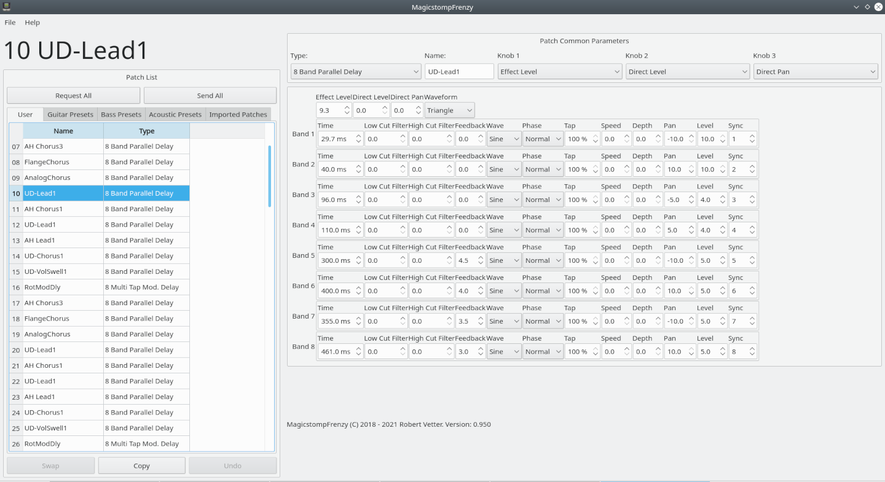
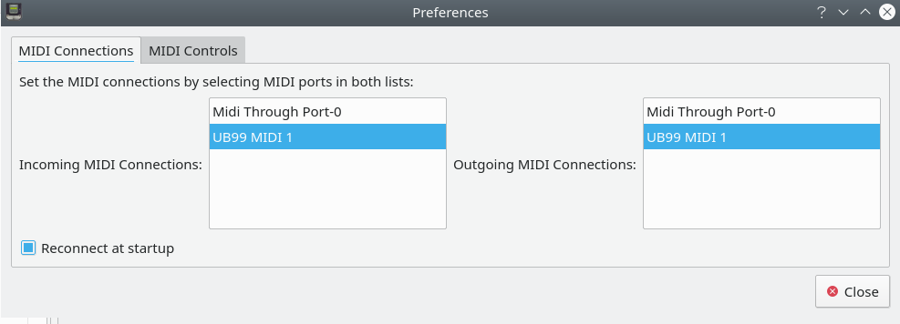

# MagicstompFrenzy Handbook

## Introduction

MagicstompFrenzy is an editor for Magicstomp multieffect processor by YAMAHA. It works on MacOS, Linux and Windows

## Installation

* On Linux the application has to be build from source.

* On MacOS the application is distributed as dmg file. 

* On Windows application is currently distributed as zip file. In order to start it unpack the zip archive including the exe file and the ini files. Start the application by double click on the exe file.

* Remember to have USB MIDI driver from Yamaha installed on your computer ( applies to MacOS and Windows, Linux does not need it, it works from the scratch!). Otherwise this application won't work!

## Working with the editor

### Setting MIDI connections

When MagicstompFrenzy is run for the first time the Preferences window appears. You have to make connections to the MIDI In and Out ports of the Magicstomp by selecting them in the lists. If no MIDI ports of the Magistomp appear there you have to install the YAMAHA MIDI USB driver first and/or connect the Magicstomp to your PC. On Windows no MIDI hotplugging is supported, so you habe to restart the application. After that you can close the preferences window.

### Requesting patches

The main window contains of the patch list window and the patch editor window. The patch list window includes user patch list and three preset patch lists plus buttons to manage patches. First you have to request user patches from the user memory of your Magicstomp. This is done by clicking on the "Request All" button. If your MIDI connection have been set probably you will see user patches being transmitted. This will take about 1 - 2 minutes for all 100 user patches.

### Editing patches

After that you can edit patches. To choose the patch to edit double-click on it in the patches list. The chosen patch will be transferred to the temporary memory of your Magicstomp and will become the "active" patch. This will also activate the editor window. In this window you can change the parameters of the chosen patch. The changes will become audible immidiately. When a patch has been changed it will be also marked with a yellow box in the list. Using the "Undo/Redo" button you can compare the orginal patch with the edited patch.

### Copying and swapping patches

You can swap and copy patches using according buttons. Swapping can be done in user memory tab only. Copying  can be done to user memory only as well.

### Importing and exporting patches

You can import patches from UB9 or SMF files into either the user or imported tab using the "File" menu. If imported into user tab you can transit all imported patches at once into your magicstomp. If imported into imported tab you can pick single patches and copy them into user tab and transfer then new setup into your magicstomp. 

User patches can be exported into UB9 or SMF file as well.

### Saving patches

You can transmit all user patches back to youy Magicstomp using the "Send All" button. Alternatively you can save the active patch using the method described in the manual if the Magicstomp ( using the "Store" and "+" "-" buttons on your Magicstomp.

## For the interested: Building MagicstompFrenzy on Linux

You can build MagicstompFrenzy like any other Qt application on Linux:

1. Make sure you have the development toolchain installed: c++ compiler ( gnu or clang ), make, git

2. Install qt development packeges for Qt core, gui and widget modules as well as qmake

3. Install ALSA library development packages

4. Clone the git repository: <pre><code>git clone https://github.com/dulnikovsky/magicstompfrenzy.git</code></pre>

5. Change into the created directory:  <pre><code>cd magicstompfrenzy</code></pre>

6. Create a build directory: <pre><code>mkdir build</code></pre>

7. Change into the created directory:  <pre><code>cd build</code></pre>

8. Run qmake: <pre><code>qmake ../MagicstompFrenzy.pro</code></pre>

9. Run make: <pre><code>make</code></pre>

After a while the build process will end and the MagicstompFrenzy executable will be present in the build directory. You can run it using the command <pre><code>./MagicstompFrenzy</code></pre>
